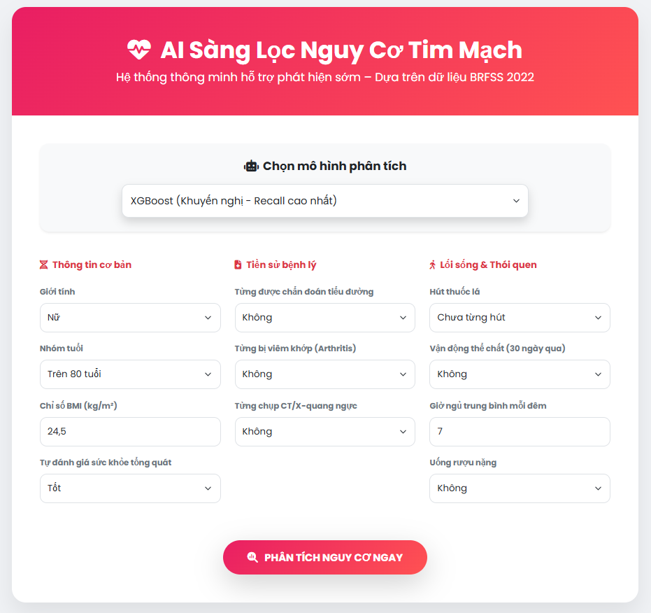

# Hệ Thống Sàng Lọc Nguy Cơ Bệnh Tim Mạch Sử Dụng Machine Learning

 <!-- Thêm ảnh screenshot nếu có; nếu không, có thể xóa dòng này -->

**Dự án phát triển một hệ thống AI hỗ trợ sàng lọc sớm nguy cơ bệnh tim mạch dựa trên dữ liệu khảo sát hành vi và sức khỏe (BRFSS 2022)**.

Hệ thống tập trung vào việc xác định các cá nhân có biểu hiện tiềm ẩn bệnh tim (như nhồi máu cơ tim hoặc đau thắt ngực) để hỗ trợ can thiệp y tế kịp thời, với ưu tiên cao về độ nhạy (recall) để giảm thiểu bỏ sót trường hợp. Dự án được thiết kế với cấu trúc modular, dễ mở rộng và triển khai, phù hợp cho ứng dụng thực tế trong y tế cộng đồng.

---

## Giới thiệu đề tài

### Bài toán
Bệnh tim mạch là nguyên nhân tử vong hàng đầu toàn cầu, theo Tổ chức Y tế Thế giới (WHO). Nhiều trường hợp có thể phòng ngừa nếu phát hiện sớm các yếu tố nguy cơ qua sàng lọc. Tuy nhiên, việc chẩn đoán truyền thống thường tốn kém và phụ thuộc vào triệu chứng rõ rệt. Dự án sử dụng dữ liệu khảo sát Behavioral Risk Factor Surveillance System (BRFSS) năm 2022 của CDC (Mỹ) để xây dựng mô hình ML hỗ trợ sàng lọc, tập trung vào phân loại nhị phân (High Risk vs Low Risk) mà không thay thế chẩn đoán y khoa chuyên sâu.

### Mục tiêu
- Xây dựng mô hình phân loại với ưu tiên **high recall** (bắt được >85% trường hợp thực dương tính) để giảm thiểu bỏ sót.
- Phát triển pipeline hoàn chỉnh: tiền xử lý dữ liệu, huấn luyện mô hình, đánh giá hiệu suất, và inference qua API + giao diện web thân thiện.
- Đảm bảo hệ thống dễ triển khai (containerizable), bảo trì (modular code), và mở rộng (thêm features/mô hình mới).
- Áp dụng các kỹ thuật xử lý imbalance data để nâng cao độ chính xác trong môi trường thực tế.

---

## Dataset

### Nguồn data
- **Link tải**: [Kaggle - Personal Key Indicators of Heart Disease](https://www.kaggle.com/datasets/kamilpytlak/personal-key-indicators-of-heart-disease)
- **File sử dụng**: `heart_2022_no_nans.csv` (phiên bản đã loại bỏ missing values, kích thước: ~246k dòng x 40 cột).
- **Mô tả**: Dữ liệu từ khảo sát BRFSS 2022, bao gồm thông tin tự báo cáo về sức khỏe, lối sống, và lịch sử bệnh lý của hơn 400k người Mỹ. Dataset được chọn vì tính đại diện cao và liên quan trực tiếp đến các yếu tố nguy cơ tim mạch.

### Mô tả cột chính (features được chọn sau feature selection)
- **AgeCategory**: Nhóm tuổi (e.g., 'Age 65 to 69' → chuẩn hóa thành '65-69').
- **BMI**: Chỉ số khối cơ thể (số thực, sau xử lý thành BMI_cat: 0-3 theo chuẩn WHO).
- **GeneralHealth**: Tự đánh giá sức khỏe tổng quát (ordinal: Excellent → Poor).
- **Sex**: Giới tính (Male/Female).
- **SmokerStatus**: Tình trạng hút thuốc (e.g., 'Never smoked', 'Current smoker').
- **PhysicalActivities**: Có hoạt động thể chất trong 30 ngày qua (Yes/No → 0/1).
- **SleepHours**: Số giờ ngủ trung bình (sau xử lý thành Sleep_risk: 1 nếu <6 hoặc >9 giờ).
- **HadDiabetes**: Tiền sử tiểu đường (Yes/No).
- **ChestScan**: Từng chụp CT ngực (Yes/No → 0/1, tín hiệu sàng lọc mạnh).
- **AlcoholDrinkers**: Uống rượu nặng (Yes/No → 0/1).
- **HadArthritis**: Tiền sử viêm khớp (Yes/No → 0/1, liên quan viêm mãn tính).
- **Target: HeartDisease**: 1 nếu từng bị nhồi máu cơ tim hoặc đau thắt ngực (dựa trên HadHeartAttack/HadAngina).

Phân bố target: ~8-10% positive (imbalanced → xử lý bằng class_weight/scale_pos_weight).

---

## Pipeline

Hệ thống theo pipeline ML chuẩn: **Tiền xử lý → Train → Evaluate → Inference**.

1. **Tiền xử lý (preprocess.py + utils.py)**:
   - Load data từ CSV, loại bỏ duplicates.
   - Tạo target HeartDisease (logical OR giữa HadHeartAttack và HadAngina).
   - Feature engineering: Chuẩn hóa AgeCategory, phân loại BMI_cat (pd.cut), tính Sleep_risk (ngủ <6 or >9 giờ).
   - Binary encoding: Yes/No → 1/0.
   - ColumnTransformer: OrdinalEncoder (AgeCategory, GeneralHealth, BMI_cat); OneHotEncoder (Sex, SmokerStatus, HadDiabetes); Passthrough (binary features).
   - Xử lý outlier: Clip BMI/SleepHours tại percentiles 1-99 (nếu cần).

2. **Train (train.py)**:
   - Split data: Stratified (64% Train, 16% Val, 20% Test) để giữ tỷ lệ imbalance.
   - Huấn luyện 3 mô hình với class_weight='balanced' hoặc scale_pos_weight.
   - Tune threshold high-recall trên Val (nới lỏng F1/Precision để max Recall, với MIN_RECALL/MIN_PRECISION tùy model).
   - Lưu bundle (.pkl): pipeline (preprocessor + model) + threshold + metadata.

3. **Evaluate**:
   - Metrics chính: Recall (ưu tiên), Precision, F1-score, ROC-AUC trên Test.
   - Confusion Matrix để đánh giá False Negative (bỏ sót).
   - So sánh các mô hình qua DataFrame styled.

4. **Inference (main.py + predict.py)**:
   - Load bundle → feature engineering input thô → predict_proba → áp threshold → tính risk level + advice cá nhân hóa.
   - API FastAPI cho web (POST /predict).
   - CLI để test nhanh (predict.py).

---

## Mô hình sử dụng

- **Logistic Regression**: Mô hình baseline tuyến tính, dễ diễn giải hệ số features. Lý do chọn: Đơn giản, nhanh, làm benchmark cho model phức tạp.
- **Random Forest**: Ensemble dựa trên cây quyết định, xử lý tốt imbalance và phi tuyến tính. Lý do chọn: Giảm overfit, cung cấp feature importance, ổn định cao.
- **XGBoost**: Gradient Boosting tiên tiến, tối ưu tốc độ và hiệu suất. Lý do chọn: Hỗ trợ scale_pos_weight cho imbalance, đạt recall cao nhất, phù hợp sàng lọc.

Tất cả mô hình được tối ưu high-recall qua threshold tuning trên Val, sử dụng class_weight để cân bằng class.

---

## Kết quả

Hiệu suất trên Test set (high-recall mode):

| Mô hình                  | Threshold (Val) | Recall | Precision | F1-score | ROC-AUC |
|--------------------------|-----------------|--------|-----------|----------|---------|
| Logistic Regression      | 0.61            | 0.686  | 0.263     | 0.380    | 0.838   |
| Random Forest            | 0.25            | 0.882  | 0.170     | 0.285    | 0.820   |
| XGBoost                  | 0.23            | 0.943  | 0.152     | 0.262    | 0.837   |

- **XGBoost nổi bật**: Recall 94.3% – bắt được hầu hết case nguy cơ cao, phù hợp mục tiêu sàng lọc.
- Confusion Matrix (XGBoost ví dụ): False Negative thấp, chấp nhận False Positive để đảm bảo an toàn.

Kết quả tái hiện chính xác từ notebook gốc, với ROC-AUC ~0.83 chứng tỏ khả năng phân biệt tốt.

---

## Hướng dẫn chạy

### Cài môi trường
1. Clone repo:
   ```bash
   git clone https://github.com/yourusername/HeartDisease_Project.git
   cd HeartDisease_Project

* Tạo virtual env:
    python -m venv venv
    source venv/bin/activate  # Windows: venv\Scripts\activate

* Cài packages:
    pip install -r requirements.txt

* Chạy train
    Huấn luyện và lưu model: python -m app.train

* Chạy demo/inference
    Khởi động API: python app/main.py
    Mở giao diện web:
        Mở demo/index.html bằng trình duyệt.
        Nhập thông tin → Nhận kết quả sàng lọc (probability, risk level, advice).

* Test CLI nhanh:
    python -m app.predict


## Cấu trúc thư mục dự án
```text
HeartDisease_Project/
├── app/
│   ├── __init__.py
│   ├── main.py          # API FastAPI
│   ├── utils.py         # Utilities (features, engineering, load/save)
│   ├── preprocess.py    # Preprocessor pipeline
│   ├── train.py         # Huấn luyện mô hình
│   └── predict.py       # CLI prediction tool
├── data/
│   ├── heart_2022_no_nans.csv  # Dataset chính (Không có sẵn tải về với link dẫn trên)
│   ├── sample_data.csv         # Dataset 50 sample đầu (Có sẵn)
│   └── README.md        # Mô tả data
├── demo/
│   ├── index.html       # Giao diện web
│   └── HeartDisease_BRFSS.ipynb  # Notebook phân tích chi tiết: EDA, feature selection, model training, threshold tuning &evaluation
├── models/              # Lưu model bundles (.pkl)
├── reports/             # Báo cáo (tùy chọn)
├── slides/              # Slide trình bày (tùy chọn)
├── README.md
├── requirements.txt     # Dependencies
└── .gitignore           # Bỏ file thừa

Tác giả
Họ tên: Vũ Xuân Anh
Mã SV: 12423004
Lớp: 124231

Họ tên: Dương Minh Chiến
Mã SV: 12423062
Lớp: 124231

Liên hệ: vuanhit02042k5@gmail.com
